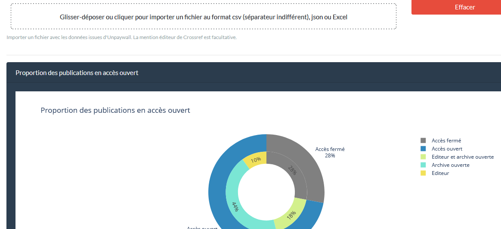

# Une application Python Dash basée sur le package [pybso](https://pypi.org/project/pybso/) pour produire son baromètre Science ouverte

 

 

L'application permet de charger son propre fichier de DOI puis : 
- d'automatiser la récupération des données d'Unpaywall et de Crossref (pour les noms des éditeurs)
- les traiter et les mettre en forme conformément aux indicateurs produits par le baromètre national
- de produire les graphiques du baromètre pour vos données

Le fichier source à uploader peut être au format csv, Excel ou Json.
Tous les fichiers de résultats issus des requêtes aux API d'Unpaywall et Crossref sont exportables en csv, Excel ou Json.
Chaque graphique est exportable en format image png.

## Voir une application de démo en ligne

[https://ggeoffroy.com/apps/self-oa-barometre/](https://ggeoffroy.com/apps/self-oa-barometre/)

## Installation en local

La version de Python doit être python3

Cloner ou exporter ce dépôt, se placer à la racine du dossier puis :

1. Sans virtualenv

       pip install -r requirements.txt

       python app.py

2. Avec virtualenv

* Créer son environnement :

        virtualenv <votre_virtualenv>

  * Pour l'activer sous Windows : 

        cd <votre_virtualenv>/Scripts && activate

  * Pour l'activer sous Linux : 

        source <votre_virtualenv>/bin/activate && cd virtualenv_name/bin/

*      pip install -r requirements.txt

*      python app.py

L'application tourne sur le port 8050 et est accessible localement à l'adresse http://localhost:8050

## ToDo

* Ajouter une vue exploratoire des données
* Ajouter des sources de données intégrées : Scopus, Wos

